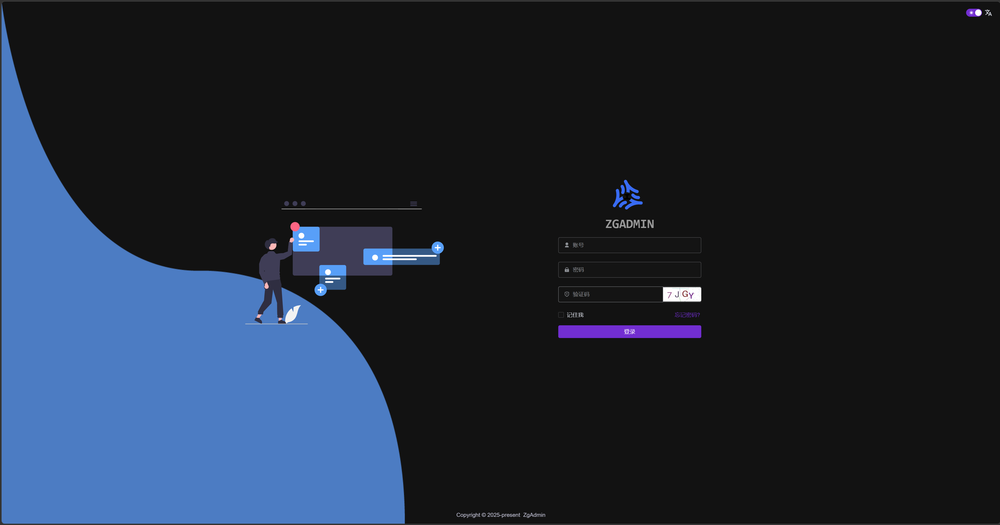
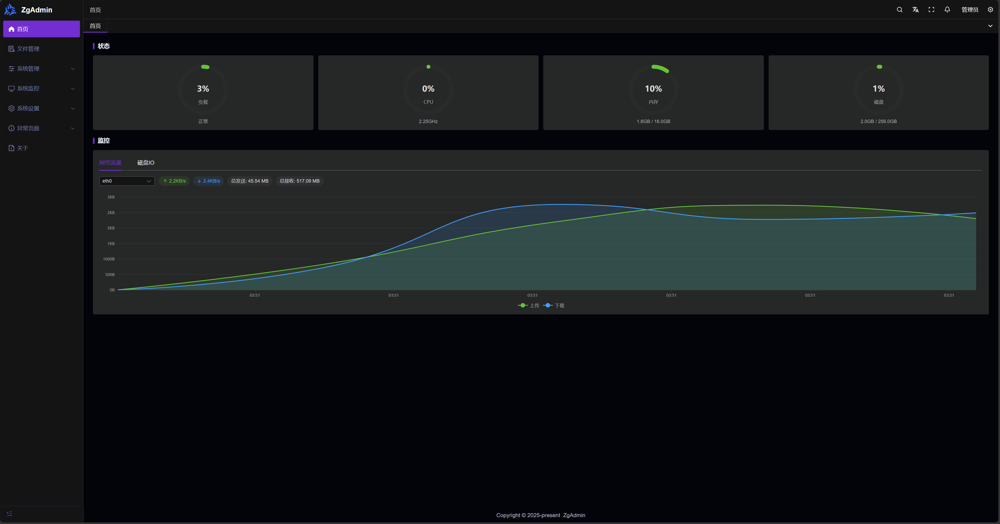
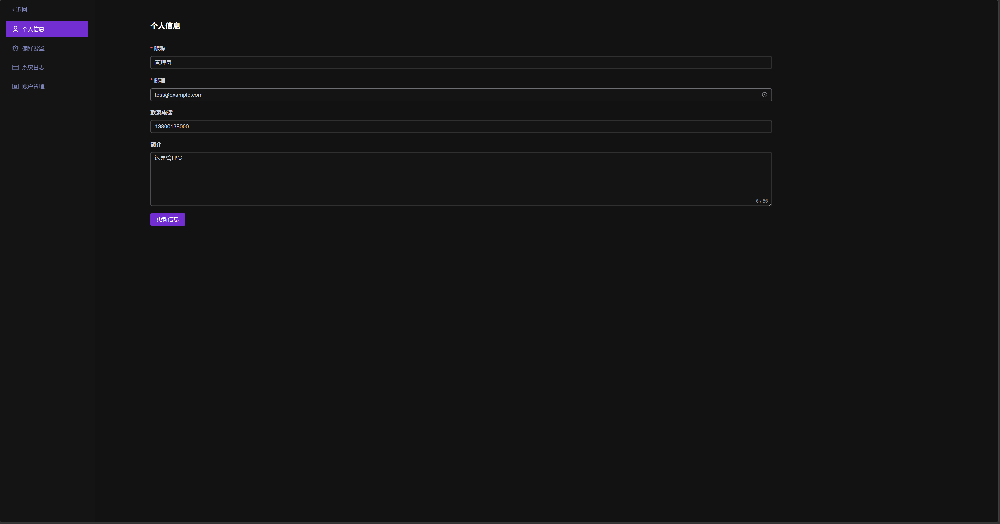
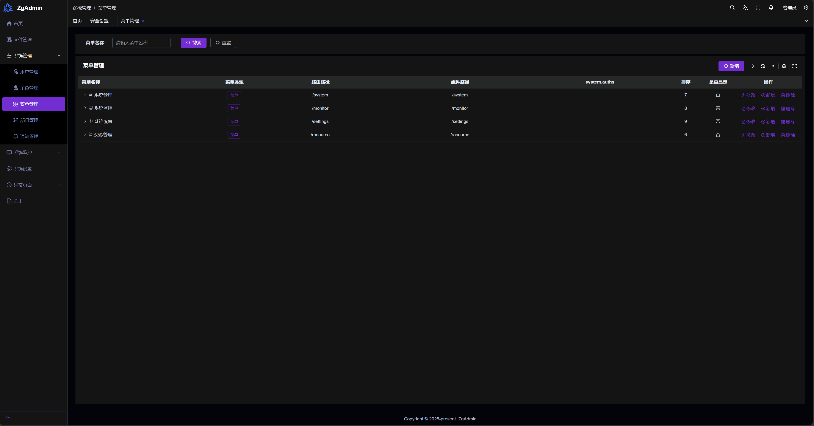
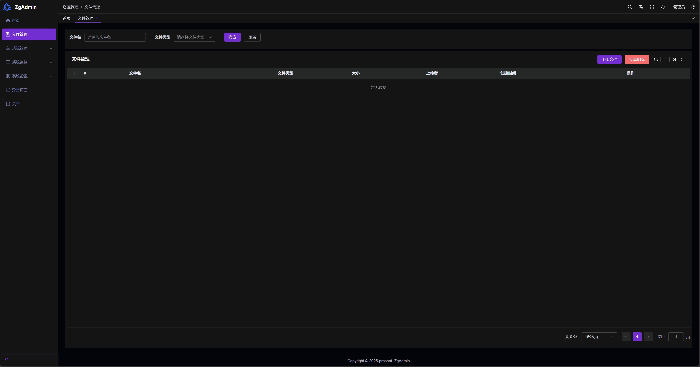
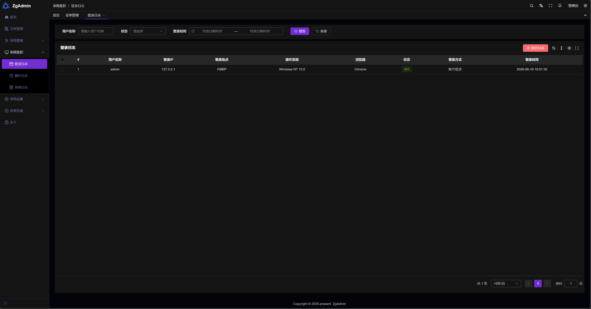
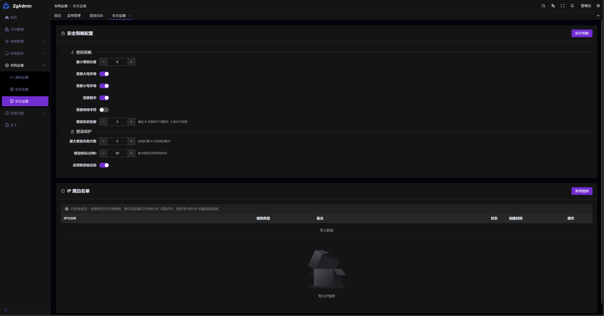
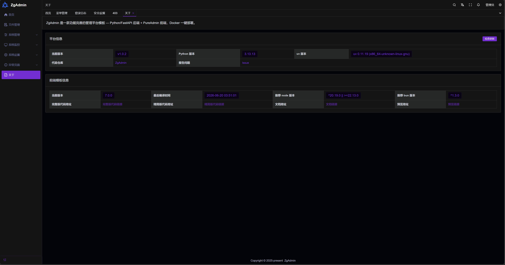
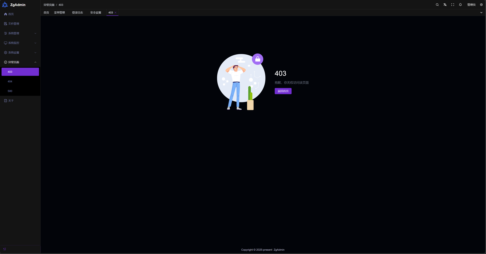

<h1 align="center">ZgAdmin</h1>

<p align="center">
  
  
  
  
  
  
  
  
</p>

管理平台模板 — Python/FastAPI 后端 + Vue 3/TypeScript 前端，Docker 一键部署。

- 🔐 **完善的权限体系** — 用户/角色/菜单/部门多级权限，支持 JWT 鉴权
- 🔑 **多种登录方式** — 账号密码、QQ 登录、微信登录
- 📊 **实时系统监控** — 在线用户、登录日志、操作日志全方位追踪
- 🌍 **国际化支持** — 中文 / English 无缝切换
- 🐳 **一键部署** — Docker 多阶段构建，SQLite 零配置即用
- 🔄 **版本更新检测** — 自动检测新版本，查看变更日志，一键更新

## 部署

### Docker Compose（推荐）

```bash
docker compose up -d
```

访问：

- 前端：<http://localhost:7000>
- 后端 API：<http://localhost:7001>

```bash
docker compose down          # 停止
docker compose logs -f       # 查看日志
```

> 容器启动时会自动执行 `alembic upgrade head`，无需手动迁移数据库。

### 更新

```bash
docker compose pull zgadmin && docker compose up -d zgadmin
```

> 也可保存为脚本方便重复使用：

```bash
cat > update.sh << 'EOF'
#!/usr/bin/env bash
set -eo pipefail
cd "$(dirname "$0")"
echo "正在拉取最新镜像..."
docker compose pull zgadmin
echo "正在重启服务..."
docker compose up -d zgadmin
echo "✓ 更新完成！"
EOF
chmod +x update.sh
./update.sh
```

## 预览

### 登录页



### 首页



### 账户管理



### 菜单管理



### 文件管理



### 日志监控



### 系统设置



### 关于



### 403 无权限



## 开发

## 技术栈

| 层 | 技术 |
|---|---|
| 后端 | Python 3.13+ / FastAPI / SQLModel / PostgreSQL |
| 前端 | Vue 3 + TypeScript + Vite + Element Plus + Tailwind CSS 4 |
| 部署 | Docker 多阶段构建 + nginx 反向代理 |

## 本地开发

### 环境要求

- Python ≥ 3.13 + [uv](https://docs.astral.sh/uv/)
- Node ≥ 20.19 + [bun](https://bun.sh/)

### 启动

```bash
bash scripts/start.sh
```

### 常用命令

```bash
# 后端
cd backend && uv run pytest          # 测试
cd backend && uv run ruff check app/   # 代码检查
cd backend && uv run ruff format app/  # 格式化

# 前端
cd frontend && bun run typecheck     # TS + Vue 类型检查
cd frontend && bun run lint          # ESLint + Prettier + Stylelint
```

### 数据迁移

```bash
cd backend

# 生成迁移脚本（根据模型变更自动检测）
uv run alembic revision --autogenerate -m "add xxx column"

# 执行迁移到最新版本
uv run alembic upgrade head

# 回退一个版本
uv run alembic downgrade -1

# 查看当前迁移状态
uv run alembic current

# 查看迁移历史
uv run alembic history

# 生成 SQL 而不执行（离线模式）
uv run alembic upgrade head --sql
```

## 配置

### Docker Compose 完整配置说明

```yaml
services:
  zgadmin:
    image: docker.cnb.cool/pylover/tools/zgadmin
    container_name: zgadmin-app
    ports:
      - "7000:80"              # 前端访问端口，左侧为宿主机端口，可按需修改
    restart: unless-stopped
    environment:
      - ENVIRONMENT=production  # 运行模式，生产环境保持 production
      # CORS 允许的前端域名，多个用逗号分隔；生产环境必须配置为实际域名，不可为 *
      - BACKEND_CORS_ORIGINS=https://your-domain.com,https://admin.your-domain.com
      - SECRET_KEY=changethis   # JWT 签名密钥，必须修改为随机字符串
      - DB_SCHEME=postgresql    # 数据库类型，Docker 部署使用 postgresql
      - DB_SERVER=postgres      # 数据库主机，Docker 中为 postgres 服务名
      - DB_PORT=5432            # 数据库端口
      - DB_PATH=zgadmin         # 数据库名，需与 POSTGRES_DB 一致
      - DB_USER=zgadmin         # 数据库用户，需与 POSTGRES_USER 一致
      - DB_PASSWORD=changethis  # 数据库密码，必须修改，需与 POSTGRES_PASSWORD 一致
      # 可选配置（未列出的默认值见下方说明）
      # - REDIS_URL=redis://zgadmin-redis:6379/0  # Redis 连接地址
      # - FIRST_SUPERUSER=admin                    # 初始管理员用户名
      # - 管理员初始密码由系统随机生成，首次启动时打印到控制台
      # - QQ_APP_ID=                               # QQ 登录 AppID，留空则隐藏入口
      # - QQ_APP_KEY=                              # QQ 登录 AppKey
      # - QQ_REDIRECT_URI=http://localhost:7000/login/qq/callback
      # - FEATURE_QQ_LOGIN=False                   # 启用 QQ 登录
      # - FEATURE_WECHAT_LOGIN=False               # 启用微信登录
      # - SMTP_HOST=                               # 邮件服务，留空则不启用
      # - SMTP_PORT=587
      # - SMTP_USER=
      # - SMTP_PASSWORD=
      # - SENTRY_DSN=                              # Sentry 监控，留空则不启用
    volumes:
      - zgadmin_data:/backend/static  # 后端静态文件（上传的附件等）
    depends_on:
      postgres:
        condition: service_healthy
        required: true

  postgres:
    image: postgres:16-alpine
    container_name: zgadmin-db
    restart: unless-stopped
    environment:
      - POSTGRES_USER=zgadmin      # 超级用户名，需与 zgadmin 的 DB_USER 一致
      - POSTGRES_PASSWORD=changethis  # 密码，必须修改，需与 zgadmin 的 DB_PASSWORD 一致
      - POSTGRES_DB=zgadmin       # 默认创建的数据库名，需与 zgadmin 的 DB_PATH 一致
    volumes:
      - pgdata:/var/lib/postgresql/data  # PostgreSQL 数据持久化

  redis:
    image: redis:7-alpine
    container_name: zgadmin-redis
    restart: unless-stopped
    command: redis-server --appendonly yes  # 启用 AOF 持久化
    volumes:
      - redisdata:/data  # Redis 数据持久化

volumes:
  zgadmin_data:
  pgdata:
  redisdata:
```

> QQ/微信登录也可通过系统设置 → 登录设置页面在线配置，无需重启。

### 本地开发环境变量

参见 [`.env.example`](.env.example)，本地开发默认使用 SQLite，零配置即可启动。

## 项目结构

```
├── backend/          # FastAPI 后端（端口 7001）
│   ├── app/api/v1/   # API 路由
│   ├── app/models/   # SQLModel 数据模型
│   ├── app/settings/ # 配置（Pydantic + INI）
│   └── app/utils/    # JWT、密码、QQ/微信 OAuth
├── frontend/         # Vue 3 前端（端口 7000）
│   ├── src/views/    # 页面（登录、系统管理、监控、设置）
│   ├── src/api/      # API 调用封装
│   └── locales/      # 国际化文案
├── docs/             # VitePress 文档站点
├── Dockerfile        # 多阶段构建
├── nginx.conf        # 前端代理 /api → 后端
├── scripts/          # 启动/更新/构建脚本
└── docker-compose.yml
```
